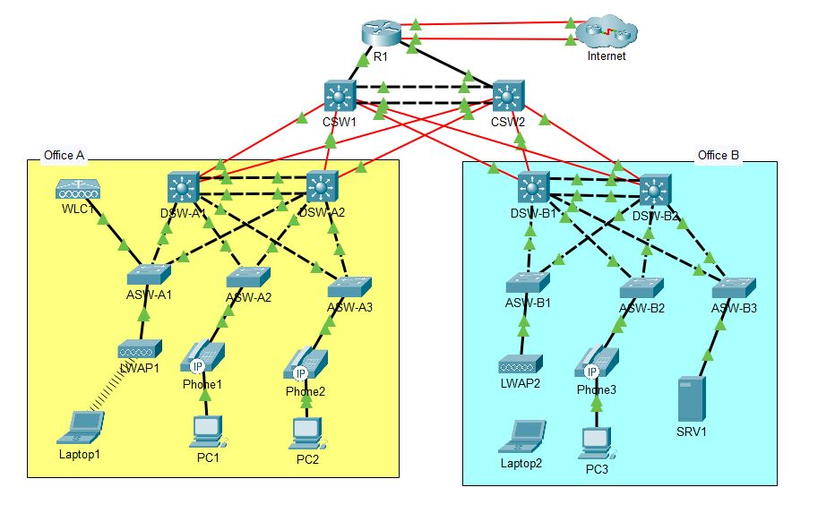

# 🌐 Enterprise Multi-Office Network Design & Implementation (CCNA Level)

This project features a comprehensive design and implementation of a multi-site enterprise network infrastructure, simulated in **Cisco Packet Tracer**. The topology is engineered to ensure **high availability, robust security, and seamless scalability**, covering advanced topics from the CCNA and CCNP curricula.

## 🚀 Key Features

* **L2/L3 Redundancy:** Implementation of EtherChannels (PAgP and LACP) for link aggregation and HSRPv2 for first-hop gateway redundancy.
* **Dynamic Routing:** Configured OSPFv2 (Area 0) with optimized passive interfaces, custom cost metrics, and stable Router-IDs.
* **Advanced Security:** Mitigated Layer 2 attacks using DHCP Snooping, Dynamic ARP Inspection (DAI), and Port Security (Sticky MACs). Extended ACLs control inter-office traffic.
* **Network Services:** Full suite of services including NAT/PAT with failover, DHCP, DNS, Authenticated NTP, SNMP, and Syslog.
* **Wireless Infrastructure:** Centralized management via WLC (Wireless LAN Controller) using WPA2-PSK security.
* **IPv6 Readiness:** Dual-stack migration using EUI-64 addressing and floating static routes for WAN backup.

---

## 🛠️ Technical Implementation Details

### 1. Switching & Layer 2 Stability
* **EtherChannel:** Configured Port-Channels between Distribution switches using Cisco-proprietary PAgP (Office A) and industry-standard LACP (Office B).
* **Spanning Tree (Rapid PVST+):** Optimized convergence by aligning the Root Bridge with the HSRP Active router to prevent sub-optimal traffic paths.
* **VLAN & VTP:** Structured network segmentation (Data, Voice, Wi-Fi, Management) propagated via VTPv2.
* **Edge Protection:** BPDU Guard and PortFast enabled on all access ports to ensure immediate connectivity and loop protection.

### 2. Routing & Connectivity
* **HSRPv2:** Configured for gateway redundancy with preemption and priority tuning to balance traffic load across distribution layers.
* **OSPFv2:** Process ID 1, Area 0. Loopback interfaces used for consistent Router-IDs. Point-to-point network types configured on transit links for faster convergence.
* **NAT/PAT:** Dynamic PAT (Overload) configured on the Edge Router (R1) with a backup floating static route for ISP failover.

### 3. Security & Management
* **Device Hardening:** Local AAA with secret password hashing (Type 9), SSHv2 only for remote management, and console timeouts.
* **Infrastructure Security:** ACLs implemented to segment the guest Wi-Fi from the internal server farm and management network.
* **L2 Security:** DHCP Snooping and DAI enabled on all access switches to prevent Rogue DHCP and ARP Spoofing attacks.

---

## 📂 Repository Structure

* `/ccna_enterprise_lab.pka`: The Cisco Packet Tracer lab file containing the full configuration.
* `/assets`: Contains the network topology diagrams and validation screenshots.
* `README.md`: Project documentation.

## 💻 How to Use
1.  Download the `.pka` file.
2.  Open it using **Cisco Packet Tracer (v8.2 or superior)**.
3.  Use the following credentials for device access:
    * **Username:** `cisco`
    * **Password:** `ccna`
    * **Enable Secret:** `jeremysitlab`
